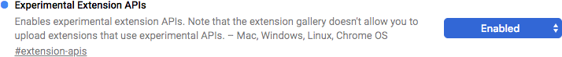
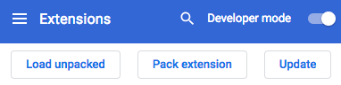
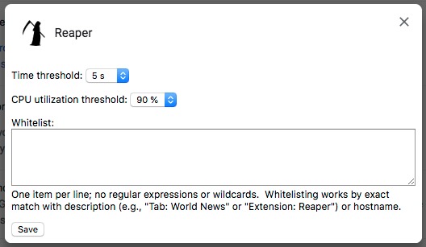

Any mention of commercial products is for information only; it does not imply
recommendation or endorsement by NIST.

The Chrome Reaper
=================

Reaper is a Chrome (or Chromium) browser extension that terminates browser
processes when they use too much CPU.  Likely targets include:

- Cryptominers
- rowhammer.js
- Web pages that enter a busy loop when ads are blocked
- Web pages and extensions that contain broken code
- Web pages and extensions that are extremely bloated and slow

When Reaper terminates a process, typically a web page goes blank or an
extension dies suddenly.  So there is no mystery why this occurred, you get a
push notification that looks something like this:

The rest of the time, Reaper shows itself to be active by displaying the
total CPU utilization of the browser in a small icon in your address bar.

Permissions
===========

The extension requires the following permissions/APIs:

- processes:  needed for the core function of monitoring and terminating processes.
- notifications:  needed to notify the user when a process is terminated.
- storage:  needed to save settings.
- tabs:  needed to determine hostnames for whitelisting.

Problematically, the
[processes](https://developer.chrome.com/extensions/processes) API is marked
as both "experimental" and "dev channel only."  However, it is possible to
enable it in the standard release of Chrome, as verified with Version
70.0.3538.77 (Official Build) (64-bit) for Mac, by following the installation
instructions below.

Installation Instructions
=========================

The extension uses an API that is marked "experimental."  Unfortunately, this
means it can't be distributed through the Chrome Web Store&mdash;you need to
install it manually.  Luckily, this is not difficult and only takes a minute:

1. Enable the experimental APIs
    1. Start Google Chrome
    2. Open up chrome://flags (this URL must be entered manually)
    3. Search for "Experimental Extension APIs" and enable 
    4. Relaunch Chrome for this to take effect (use the Relaunch button that appears at the bottom of the screen and all your open tabs will be preserved)

2. Install the extension
    1. Download either [Reaper-1.1.2.tar.xz](https://github.com/usnistgov/Metrology/blob/master/Reaper/Reaper-1.1.2.tar.xz) or [Reaper-1.1.2.zip](https://github.com/usnistgov/Metrology/blob/master/Reaper/Reaper-1.1.2.zip) (don't right-click; click through and then Download)
    2. Unpack the archive file somewhere permanent
    3. Select More Tools > Extensions from the Chrome menu or manually enter the URL chrome://extensions
    4. Ensure the "Developer mode" toggle at the top of the page is on, and click the "Load unpacked" button 
    5. Browse to select the folder containing the files you've just unpacked
    6. The extension will appear in your address bar.

Do not delete the unpacked files after installation; the extension may fail
with "File Not Found" errors if you do.

Settings
========

To access and change settings, right click on Reaper's tiny icon in the
address bar and choose Options from the menu.

Threshold
---------

Reaper terminates a process when its CPU utilization consistently meets or
exceeds a threshold for a specified length of time.  The CPU threshold can be
adjusted between 10% and 90% in increments of 10%.  The time can be set to
various values ranging between 3 seconds and 30 seconds.

The default threshold of 90% utilization for 5 seconds will catch malware
that saturates the CPU while allowing a reasonable time for benign web pages
to finish rendering.  In most cases, reducing the time to 3 seconds will
improve reaction time without causing collateral damage.  However, on very
slow systems, the time might need to be increased to avoid terminating benign
web pages before they finish rendering.

Some cryptominers are designed to limit their CPU utilization to a level well
below 90% to avoid detection.  To detect these, one can specify a lower
utilization threshold combined with a longer time interval.

Since the appropriate CPU utilization threshold can vary based on the speed
of the computer, settings are saved only in local storage; they are never
synced to other devices.

Whitelist
---------

In the event that some extension or web site must be allowed to run even
though it may exceed the threshold, it can be exempted using the whitelist.
A process can be exempted in two ways:  by description or by hostname.

Every process has a description like "Tab: World News" or "Extension: Reaper"
that can be used to identify it.  For active processes, this description can
be obtained from the Task Manager (More Tools > Task Manager from the Chrome
menu).  For processes that Reaper has just terminated, it can be found in the
console log (see <a href="#log">Troubleshooting</a>) and in the push
notification.

Processes that are rendering web pages can furthermore be exempted by
whitelisting the hostname that appears in the URL.  This allows an entire
site to be exempted, while a single page on the site could be exempted by
description.

If whitelisting a hostname seems not to work, check the URL of the terminated
process in the console log.  Sites are sometimes subtly redirected, e.g.,
from example.test to www.example.test.  You need to whitelist the hostname
that was actually terminated.

Security
========

Reaper serves as a final, reactive layer of defense against cryptominers and
other in-browser malware that chews up CPU.  If something malicious is killed
by Reaper, this means that it got through all previous, proactive layers of
defense and was actively running in your browser.  If you or your security
officer determine that the suspicious item was indeed malicious, you/they
should take actions such as

- Adjust your blocker to block it
- Report it to your perimeter security team so they can block it
- Report it to [Google Safe Browsing](https://safebrowsing.google.com/safebrowsing/report_badware/) and possibly [other similar services](https://decentsecurity.com/malware-web-and-phishing-investigation/)
- Report it to their hosting company to take down the source

Reaper does no kind of filtering or identification of content; it only
monitors CPU utilization.

In terms of net risk, there is a tradeoff between Reaper's mitigation of
in-browser malware and the significant expansion of the attack surface and
weakening of browser defenses that results from enabling experimental APIs
and developer mode.

Privacy
=======

When Reaper terminates a process, the description and associated URL (if
available) are written to the console log and included in the push
notification.

Isolation Problem
=================

Certain Chrome isolation features are ineffective on Reaper.

- If multiple user profiles ("people") are active simultaneously, Reaper will
terminate processes belonging to user profiles other than the one in which
Reaper is installed.
- Reaper will terminate incognito processes even when Reaper's "Allow in
incognito" switch is turned off.

When a profile or incognito mode boundary is crossed, Reaper may be unable to
determine the URL associated with a process.  In that case, the URL will not
appear in the log, and whitelisting the hostname will not work.

Other Known Problems
====================

The descriptions of processes are too long for push notifications.

Troubleshooting
=================================

Reaper's attempts to terminate processes and possible failures can be found
in the extension's console log under Developer Tools.  To view the log:

1. Select More Tools > Extensions from the Chrome menu or manually enter the URL chrome://extensions
2. Under Reaper, next to Inspect views, click on background.html
3. Select the Console tab if it is not already selected

Change Log
==========

2019-08-19:  Version 1.1.2:

- Documented Reaper's disrespect of profile and incognito mode boundaries.
- Muted "No tab with id" errors associated with boundary transgression.
- Fixed missing notifications by ignoring the result from chrome.processes.terminate.

2019-05-07:  Version 1.1.1:  Revised documentation.

2018-11-28:  Version 1.1:

- Improved descriptions of processes in notifications and log messages.
- Added whitelist feature.
- Improved formatting in options popup.
- Tabs permission is now required.

2018-10-31:  Version 1.0:  First release.

Inherited License and Credits
=============================

Source code and installation instructions of Reaper were based on Process Monitor for
Chrome by Andy Young [@andyy](http://twitter.com/andyy), code at
[https://github.com/andyyoung/Process-Monitor-for-Chrome](https://github.com/andyyoung/Process-Monitor-for-Chrome)
(MIT license, see below).

options.html and options.js were based on the example provided at
[https://developer.chrome.com/extensions/options](https://developer.chrome.com/extensions/options)
(CC-By 3.0).

The icon of Reaper is from
[https://pixabay.com/en/death-grim-reaper-reaper-scythe-2024663/](https://pixabay.com/en/death-grim-reaper-reaper-scythe-2024663/)
(CC0).

Text of the original license of Process Monitor for Chrome follows.

Process Monitor for Chrome
Copyright (c) 2013 Andy Young

Permission is hereby granted, free of charge, to any person obtaining a copy
of this software and associated documentation files (the "Software"), to deal
in the Software without restriction, including without limitation the rights
to use, copy, modify, merge, publish, distribute, sublicense, and/or sell
copies of the Software, and to permit persons to whom the Software is
furnished to do so, subject to the following conditions:

The above copyright notice and this permission notice shall be included in
all copies or substantial portions of the Software.

THE SOFTWARE IS PROVIDED "AS IS", WITHOUT WARRANTY OF ANY KIND, EXPRESS OR
IMPLIED, INCLUDING BUT NOT LIMITED TO THE WARRANTIES OF MERCHANTABILITY,
FITNESS FOR A PARTICULAR PURPOSE AND NONINFRINGEMENT. IN NO EVENT SHALL THE
AUTHORS OR COPYRIGHT HOLDERS BE LIABLE FOR ANY CLAIM, DAMAGES OR OTHER
LIABILITY, WHETHER IN AN ACTION OF CONTRACT, TORT OR OTHERWISE, ARISING FROM,
OUT OF OR IN CONNECTION WITH THE SOFTWARE OR THE USE OR OTHER DEALINGS IN
THE SOFTWARE.

NIST Software Disclaimer
========================

This extension was developed by David Flater, david.flater@nist.gov.

This software was developed by employees of the National Institute of
Standards and Technology (NIST), an agency of the Federal Government and is
being made available as a public service.  Pursuant to title 17 United States
Code Section 105, works of NIST employees are not subject to copyright
protection in the United States.  This software may be subject to foreign
copyright.  Permission in the United States and in foreign countries, to the
extent that NIST may hold copyright, to use, copy, modify, create derivative
works, and distribute this software and its documentation without fee is
hereby granted on a non-exclusive basis, provided that this notice and
disclaimer of warranty appears in all copies.

THE SOFTWARE IS PROVIDED 'AS IS' WITHOUT ANY WARRANTY OF ANY KIND, EITHER
EXPRESSED, IMPLIED, OR STATUTORY, INCLUDING, BUT NOT LIMITED TO, ANY WARRANTY
THAT THE SOFTWARE WILL CONFORM TO SPECIFICATIONS, ANY IMPLIED WARRANTIES OF
MERCHANTABILITY, FITNESS FOR A PARTICULAR PURPOSE, AND FREEDOM FROM
INFRINGEMENT, AND ANY WARRANTY THAT THE DOCUMENTATION WILL CONFORM TO THE
SOFTWARE, OR ANY WARRANTY THAT THE SOFTWARE WILL BE ERROR FREE.  IN NO EVENT
SHALL NIST BE LIABLE FOR ANY DAMAGES, INCLUDING, BUT NOT LIMITED TO, DIRECT,
INDIRECT, SPECIAL OR CONSEQUENTIAL DAMAGES, ARISING OUT OF, RESULTING FROM,
OR IN ANY WAY CONNECTED WITH THIS SOFTWARE, WHETHER OR NOT BASED UPON
WARRANTY, CONTRACT, TORT, OR OTHERWISE, WHETHER OR NOT INJURY WAS SUSTAINED
BY PERSONS OR PROPERTY OR OTHERWISE, AND WHETHER OR NOT LOSS WAS SUSTAINED
FROM, OR AROSE OUT OF THE RESULTS OF, OR USE OF, THE SOFTWARE OR SERVICES
PROVIDED HEREUNDER.
