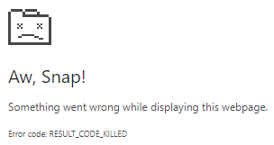
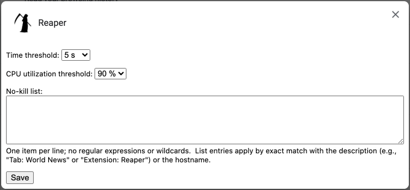

[Public Data Resource record](https://data.nist.gov/od/id/7D6696ECDA1445A2E0532457068131DE2013) (MIDAS record # 2013)  
doi:[10.18434/T4/1503404](https://doi.org/10.18434/T4/1503404)

Any mention of commercial products is for information only; it does not imply
recommendation or endorsement by NIST.

Chrome Reaper
=============

Reaper is a Chrome (or Chromium) browser extension that terminates browser
processes when they use too much CPU.  Anything that the browser regards as
a process is a potential target.  This includes tabs, renderers, subframes,
other extensions, and itself.

Reaper responds to the following problems:

- Web pages that enter a busy loop when ads are blocked
- Web pages and extensions that have bugs resulting in high CPU utilization
- Web pages and extensions that are just heavyweight, bloated, and slow
- Malicious and otherwise unwanted JavaScript (e.g., uninvited cryptominers)

When Reaper terminates a process, typically a web page goes blank with a
message like the following:

So there is no mystery why this occurred, you get a push notification that
looks something like this:

The rest of the time, Reaper shows itself to be active by displaying the
total CPU utilization of the browser in a small icon in the toolbar:

Supported browser versions
==========================

At the time of writing, Reaper works in the stable channel release of Chrome
for Linux, but a [dev channel
release](https://www.chromium.org/getting-involved/dev-channel/) is required
on Windows, MacOS, and ChromeOS.

Reaper 2.0 worked when tested on the following versions of Chrome:

- Linux:  Chrome Version 120.0.6099.109 (Official Build) unknown (64-bit)
- MacOS Monterey:  Version 122.0.6182.0 (Official Build) dev (x86_64)
- Windows 10:  Version 122.0.6182.0 (Official Build) dev (64-bit)

For ChromeOS, the entire device has to be [switched to the dev channel](https://support.google.com/chromebook/answer/1086915?hl=en) before Reaper could possibly work.  This was not tested.

Reaper is not supported on Android because the Android / Play Store versions of Chrome do not support extensions.  When tested on the Chromium-based Kiwi Browser (Dev) 120.0.6099.26, Reaper installed but did not work correctly.

Permissions
===========

Reaper requires the following permissions/APIs:

- processes:  needed for the core function of identifying, monitoring, and terminating processes.  The [processes API](https://developer.chrome.com/docs/extensions/reference/api/processes) is marked "dev channel only."
- notifications:  needed to notify the user when a process is terminated.
- tabs (also known as "read your browsing history"):  needed to determine hostnames for no-kill listing.
- storage:  needed to save settings.

Installation instructions
=========================

The following instructions describe in detail how to sideload Reaper.

1. Download either [Reaper-2.0.1.tar.xz](https://github.com/usnistgov/Metrology/blob/master/Reaper/Reaper-2.0.1.tar.xz) or [Reaper-2.0.1.zip](https://github.com/usnistgov/Metrology/blob/master/Reaper/Reaper-2.0.1.zip) (don't right-click; click through and then Download)
2. Unpack the archive file somewhere permanent
3. Launch the Chrome browser
4. Open Chrome's extensions manager.  There are various ways to do it:
    - Type the URL chrome://extensions in the search bar at the top and hit Enter
    - Left click on the vertical ellipsis in the upper right corner of Chrome to open the menu, hover the mouse over the "Extensions" menu item to open the submenu, and left click on "Manage Extensions"
    - Left click on the puzzle piece (Extensions) icon in the toolbar, then left click on "Manage extensions" at the bottom of the pop-up that appears
    - While in Chrome Settings, left click on "Extensions" near the bottom of the list on the left side of the window
5. Ensure the "Developer mode" toggle at the top of the page is on:  if the circle is on the left, click it to move it to the right

    

6. Click the "Load unpacked" button
7. Browse to the parent directory that contains the folder named Reaper-2.0.1
8. Select the folder named Reaper-2.0.1 but do not browse into it.  This is done in one of the following ways depending on your platform and desktop preferences:
    - Hold a shift key and left click on the folder (Linux/KDE, ChromeOS)
    - Left click on the folder (MacOS)
    - Hover the mouse pointer over the folder name until it is highlighted (Windows)
9. Click "Open" at the bottom
10. A message should say "Extension loaded" and a box for the extension should appear in the main area of the extensions manager
11. Pin the extension to the toolbar.  There are two ways to do it:
    - Left click the "Details" button inside the extension's box in extension manager, scroll down to "Pin to toolbar," and left click the toggle to toggle it on
    - Left click on the puzzle piece (Extensions) icon in the toolbar, then left click on the grayed pin icon beside Reaper
12. The extension's CPU utilization icon should then appear in the toolbar

Do not delete the unpacked files after installation.  If you do, the
extension may fail with "File Not Found" errors.

Settings
========

To access Reaper's settings, do one of the following:

- Right click on Reaper's icon in the toolbar and then left click on "Options" in the menu that appears
- Left click on the puzzle piece (Extensions) icon in the toolbar, left click on the vertical ellipsis beside Reaper, and then left click on "Options" in the menu that appears
- Left click the "Details" button inside Reaper's box in extension manager and left click on "Extension options" in the list that appears

Threshold
---------

Reaper terminates a process when its CPU utilization consistently meets or
exceeds a threshold for a specified length of time.  The CPU threshold can be
adjusted between 10% and 90% in increments of 10%.  The time can be set to
various values ranging between 3 seconds and 30 seconds.

The default threshold is 90% utilization for 5 seconds.  If a favorite web
site or extension is slow to load, the time threshold might need to be
increased.

Some cryptominers are designed to limit their CPU utilization to a level
below 90% to avoid detection.  One can specify a lower utilization threshold
combined with a longer time interval to catch these.

Since the appropriate CPU utilization threshold can vary based on the speed
of the computer, settings are saved only in local storage; they are never
synced to other devices.

No-kill list
------------

In the event that some extension or web site must be allowed to run even
though it may exceed the threshold, it can be exempted using the no-kill
list.  A process can be exempted in two ways:  by description or by hostname.

Every process has a description like "Tab: World News" or "Extension: Reaper"
that can be used to identify it.  For active processes, this description can
be obtained from Chrome's task manager.  To access the task manager, do one
of the following:

- Hold a shift key and press Esc
- Left click on the vertical ellipsis in the upper right corner of Chrome to
open the menu, hover the mouse over the "More tools" menu item to open the
submenu, and left click on "Task manager"

For processes that Reaper has just terminated, the description can be found
in the console log and in the push notification.  To view the log, left click
the "service worker" link next to "Inspect views" inside Reaper's box in
extension manager.

Processes that render web pages can furthermore be exempted by listing the
hostname that appears in the URL.  This allows an entire site to be exempted
instead of only a single page.  If listing a hostname seems not to work,
check the URL of the terminated process in the console log.  Sites are
sometimes subtly redirected, e.g., from example.test to www.example.test.
You need to list the hostname that was actually in use by the terminated
process.

It is possible for a web page to exceed the thresholds for termination before
its hostname is made available to Reaper.  In such cases, only the
description is usable to prevent termination.

Security
========

Reaper serves as a final, reactive layer of defense based on a single
indicator (CPU utilization).  If something malicious is killed by Reaper,
this means that it got through all previous, proactive layers of defense and
was running its payload in your browser.  If you or your security officer
determine that the suspicious item was indeed malicious, you/they should take
actions such as

- Adjust your blocker to block it
- Report it to your organization's security team so they can block it
- Report it to [Google Safe Browsing](https://safebrowsing.google.com/safebrowsing/report_badware/) and possibly [other similar services](https://decentsecurity.com/malware-web-and-phishing-investigation/)
- Report it to the relevant hosting company to consider taking down the source

Reaper does no kind of filtering or identification of content.  It only
monitors CPU utilization.  Malicious web content and extensions will not be
terminated if their CPU utilization is under the threshold.

In terms of net risk, Reaper's mitigation of in-browser malware must be
weighed against the potential consequences of terminating benign processes
and the expansion of attack surface that results from running dev channel
Chrome.

Privacy
=======

When Reaper terminates a process, the description and associated URL (if
available) are written to the console log and included in the push
notification.  Thus, the affected portion of your browsing history may leak
through these channels.

Lack of profile containment
===========================

Chrome's profile isolation does not apply to Reaper.

- If multiple user profiles ("people") are active simultaneously, Reaper will
terminate processes belonging to user profiles other than the one in which
Reaper is installed.
- Reaper will terminate incognito processes even when Reaper's "Allow in
incognito" switch is turned off.

When a profile or incognito mode boundary is crossed, Reaper may be unable to
determine the URL associated with a process.  In that case, the URL will not
appear in the log and no-kill listing the hostname will not work.

Other issues
============

The Reaper extension is not robust against a service worker shutdown by
Chrome.

Reaper just becomes inactive sometimes (icon stops updating, console log goes
blank, processes are not terminated).  It remains unclear whether this
corresponds to a service worker shutdown or is a separate issue (e.g., it
killed itself).

The descriptions of processes are too long for push notifications.

Subframes are new.  Examples observed had URLs but the descriptions were just
"Subframe."

The puzzle piece toolbar icon is sometimes missing and appears only after
Reaper is installed.

Troubleshooting
===============

Reaper's attempts to terminate processes and possible failures can be found
in the extension's console log.  To view the log, left click the "service
worker" link next to "Inspect views" inside Reaper's box in extension
manager.

Uncaught exceptions can be viewed by left clicking on a red "Errors" button
that appears inside Reaper's box in extension manager.

Change log
==========

2024-01-02:  Minor post-release updates to README not included in 2.0.1
tarballs:

- Documented a third way to access Reaper's settings.
- Added DOI, MIDAS record number, and link to Reaper's record in the NIST Public Data Repository.

2023-12-19:  Version 2.0.1:

- Silenced "Process not found" error that occurs when a targeted process died already and Reaper lost the race.
- Cleaned up some undefined and null checks.

2023-12-19:  Version 2.0:

- Migrated to Manifest V3, which required conversion from background page to service worker.
- Fixed a warning about the willReadFrequently attribute.
- Fixed CPU utilization being NaN% occasionally.

2020-06-08:  Version 1.1.3:  Renamed whitelist to no-kill list.

2019-08-19:  Version 1.1.2:

- Documented Reaper's disrespect of profile and incognito mode boundaries.
- Muted "No tab with id" errors associated with boundary transgression.
- Fixed missing notifications by ignoring the result from chrome.processes.terminate.

2019-05-07:  Version 1.1.1:  Revised documentation.

2018-11-28:  Version 1.1:

- Improved descriptions of processes in notifications and log messages.
- Added whitelist feature.
- Improved formatting in options popup.
- Tabs permission is now required.

2018-10-31:  Version 1.0:  First release.

Inherited license and credits
=============================

The source code and installation instructions of Reaper were forked from Process Monitor for
Chrome by Andy Young [@andyy](http://twitter.com/andyy), code at
[https://github.com/andyyoung/Process-Monitor-for-Chrome](https://github.com/andyyoung/Process-Monitor-for-Chrome)
(MIT license, see below).

options.html and options.js were based on the example provided at
[https://developer.chrome.com/extensions/options](https://developer.chrome.com/extensions/options)
(CC-By 3.0).

The icon of Reaper is from
[https://pixabay.com/en/death-grim-reaper-reaper-scythe-2024663/](https://pixabay.com/en/death-grim-reaper-reaper-scythe-2024663/)
(CC0).

Text of the original license of Process Monitor for Chrome follows.

Process Monitor for Chrome
Copyright (c) 2013 Andy Young

Permission is hereby granted, free of charge, to any person obtaining a copy
of this software and associated documentation files (the "Software"), to deal
in the Software without restriction, including without limitation the rights
to use, copy, modify, merge, publish, distribute, sublicense, and/or sell
copies of the Software, and to permit persons to whom the Software is
furnished to do so, subject to the following conditions:

The above copyright notice and this permission notice shall be included in
all copies or substantial portions of the Software.

THE SOFTWARE IS PROVIDED "AS IS", WITHOUT WARRANTY OF ANY KIND, EXPRESS OR
IMPLIED, INCLUDING BUT NOT LIMITED TO THE WARRANTIES OF MERCHANTABILITY,
FITNESS FOR A PARTICULAR PURPOSE AND NONINFRINGEMENT. IN NO EVENT SHALL THE
AUTHORS OR COPYRIGHT HOLDERS BE LIABLE FOR ANY CLAIM, DAMAGES OR OTHER
LIABILITY, WHETHER IN AN ACTION OF CONTRACT, TORT OR OTHERWISE, ARISING FROM,
OUT OF OR IN CONNECTION WITH THE SOFTWARE OR THE USE OR OTHER DEALINGS IN
THE SOFTWARE.

NIST software disclaimer
========================

This extension was developed by David Flater, david.flater@nist.gov.

This software was developed by employees of the National Institute of
Standards and Technology (NIST), an agency of the Federal Government and is
being made available as a public service.  Pursuant to title 17 United States
Code Section 105, works of NIST employees are not subject to copyright
protection in the United States.  This software may be subject to foreign
copyright.  Permission in the United States and in foreign countries, to the
extent that NIST may hold copyright, to use, copy, modify, create derivative
works, and distribute this software and its documentation without fee is
hereby granted on a non-exclusive basis, provided that this notice and
disclaimer of warranty appears in all copies.

THE SOFTWARE IS PROVIDED 'AS IS' WITHOUT ANY WARRANTY OF ANY KIND, EITHER
EXPRESSED, IMPLIED, OR STATUTORY, INCLUDING, BUT NOT LIMITED TO, ANY WARRANTY
THAT THE SOFTWARE WILL CONFORM TO SPECIFICATIONS, ANY IMPLIED WARRANTIES OF
MERCHANTABILITY, FITNESS FOR A PARTICULAR PURPOSE, AND FREEDOM FROM
INFRINGEMENT, AND ANY WARRANTY THAT THE DOCUMENTATION WILL CONFORM TO THE
SOFTWARE, OR ANY WARRANTY THAT THE SOFTWARE WILL BE ERROR FREE.  IN NO EVENT
SHALL NIST BE LIABLE FOR ANY DAMAGES, INCLUDING, BUT NOT LIMITED TO, DIRECT,
INDIRECT, SPECIAL OR CONSEQUENTIAL DAMAGES, ARISING OUT OF, RESULTING FROM,
OR IN ANY WAY CONNECTED WITH THIS SOFTWARE, WHETHER OR NOT BASED UPON
WARRANTY, CONTRACT, TORT, OR OTHERWISE, WHETHER OR NOT INJURY WAS SUSTAINED
BY PERSONS OR PROPERTY OR OTHERWISE, AND WHETHER OR NOT LOSS WAS SUSTAINED
FROM, OR AROSE OUT OF THE RESULTS OF, OR USE OF, THE SOFTWARE OR SERVICES
PROVIDED HEREUNDER.
